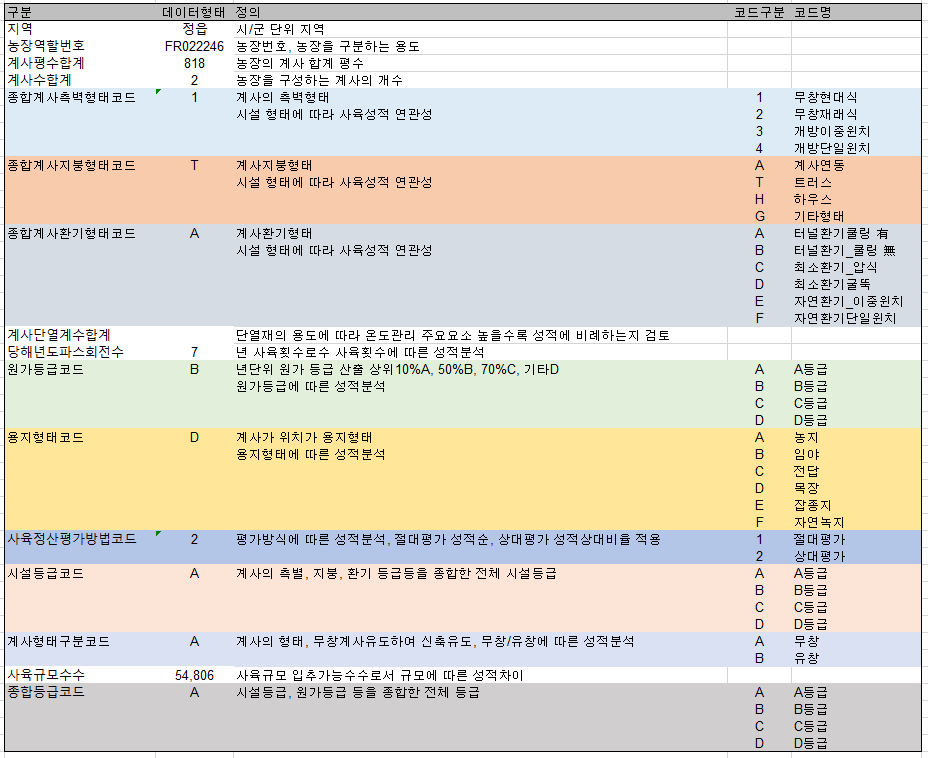

## 2017 빅데이터 아카데미 제조 빅데이터 분석 파일럿 프로젝트 2조

### 데이터/ 소스코드/ RMarkdown/ 시각화 자료 등을 여기서 관리해 보세요  

> 폴더는 다음과 같이 분류하면 좋습니다

|
폴더명
|
폴더 내용
|
|:------------:|:--------------------------------------:|
|data|데이터 소스를 담는 폴더|
|script|R 소스 코드를 담는 폴더|
|img|시각화 파일을 담는 폴더|
|RMD|RMarkdown을 담는 폴더|

***

> 2조 데이터 분석 개요

* 개요 
  + 600여 농가중 매월 2일 도계수수의 개체중량을 전체 수집
  + 농가별 개체별 중량을 분석하여 분포도를 확인하고 좋고, 나쁨의 판단, 각 변수별 좋고 나쁨의 연관관계 분석
* Data 주기 : 12개월중 월별 2일 수집, 약 400만건

***

> 프로젝트 발표자료 작성 내용

* 프로젝트 개요
  + 배경 및 목적
  + 기대효과
  + 수행일정
* 데이터의 이해
  + 데이터 선정 및 수집방법
  + 데이터 정제: 이상치, 결측치 제거, 변수 분류 등
  + 탐색적 데이터 분석: 기초 통계 (분포, 상관분석, 의사결정 나무 등)
* 데이터 모델링
  + 분석 방법: 나무모형, 회귀분석, 시계열 분석,랜덤 포레스트, k-NN, 뉴럴넷
  + 분석 결과
* 데이터 시각화
  + 시각화 방법
  + 시각화 결과
* 결론
  + 프로젝트를 통한 시사점
  + 향후 발전 방향

***

> `데이터 분석`을 위한 참고 자료
- [R에서 자유자재로 데이터 가공하기](http://rpubs.com/jmhome/R_data_wrangling)
- [R에서 데이터 정제하기 (결측치,이상치)](http://rpubs.com/jmhome/R_data_processing)
- [R에서 통계기법을 이용한 가설 검정](http://rpubs.com/jmhome/StatisticalAnalysis)
- [R에서 한글문서 열때 인코딩 문제 해결](http://philogrammer.com/2017-03-15/encoding)

> `데이터 시각화`를 위한 참고 자료
- [샤이니 보드를 활용한 Interactive Chart 구현](https://www.slideshare.net/r-kor/ruck-2017-interactive-chart)
- [R Shiny를 이용한 데이터 시각화](https://rstudio.github.io/shinydashboard/index.html)
- [R을 위한 대화형 대시보드 제작](http://rmarkdown.rstudio.com/flexdashboard/)
- [R을 위한 다이나믹 차트 구현](http://rstudio.github.io/crosstalk/)
- [JavaScript 데이터 시각화를 R과 연동](http://www.htmlwidgets.org/)

> 기타 유용한 참고 자료
- [R 코딩 스타일 가이드](http://rpubs.com/jmhome/R_CodingStyle)

